# IT Helpdesk Simulation — Jira Service Management

## 📌 Overview
This project simulates the full lifecycle of an IT support helpdesk using **Jira Service Management**. It covers request configuration, SLA tracking, incident resolution, and a final data analysis of the resolved tickets — demonstrating both IT support fundamentals and a data-driven approach to service quality.

**Goal:** Build and document a realistic Level 2 IT support workflow, from ticket intake to KPI reporting.

## 🛠️ Tools Used
- Jira Service Management (ITSM template)
- VirtualBox / VMware (local VM for troubleshooting simulation)
- Linux (Ubuntu) & Windows
- Power BI / Python (pandas) for the final ticket analysis

## 🏗️ Architecture
<!-- Add a simple diagram here later showing: Customer Portal -> Jira Queue -> Agent (VM troubleshooting) -> Resolved Ticket -> CSV Export -> Dashboard -->

## 📋 Week 1 — Helpdesk Setup
- Created a team-managed space **"IT Helpdesk Simulation"** using the ITSM Essentials template.
- Configured 3 request types:
  - **Hardware Issue** — hardware failures, boot issues, peripheral problems
  - **Network Problem** — VPN and connectivity issues
  - **Software/Access Issue** — account access and login problems
- Configured 2 SLAs:
  - **Time to First Response** — 4 hours
  - **Time to Resolution** — 24 hours

**Screenshots:**
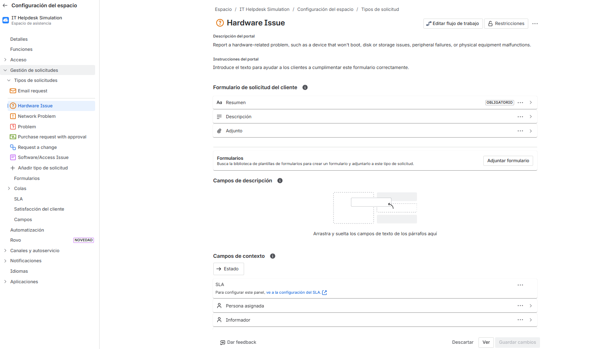
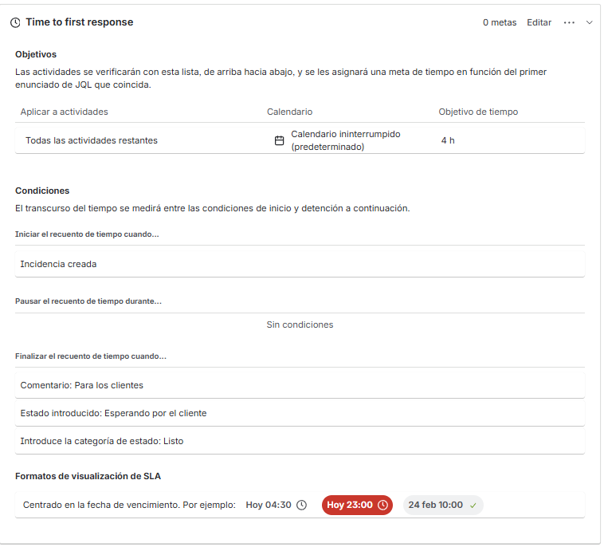
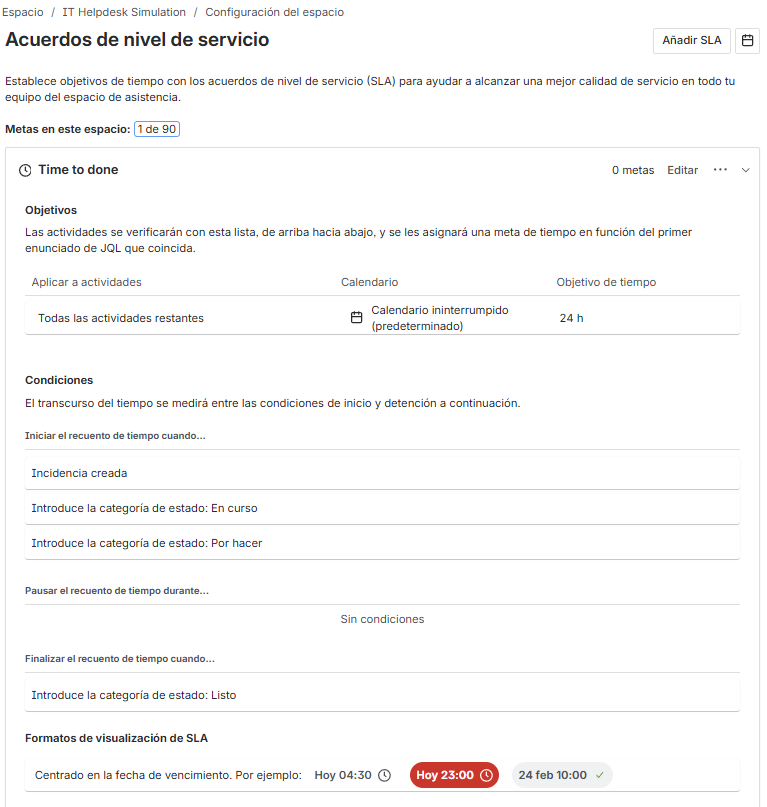

## 🎫 Week 2 — Ticket Generation
Created 2 fictional customer profiles (Maria Gomez, Carlos Ruiz) and generated 3 simulated tickets:

| Ticket | Type | Summary | Reporter |
|--------|------|---------|----------|
| IHS-3 | Hardware Issue | Laptop won't boot after Windows update | Maria Gomez |
| IHS-4 | Network Problem | Unable to connect to company VPN | Carlos Ruiz |
| IHS-5 | Software/Access Issue | Account locked after multiple failed login attempts | Maria Gomez |

## 🔧 Week 3 — Troubleshooting & Resolution
Set up a local Ubuntu 26.04 VM (VirtualBox) to simulate hands-on diagnostics for each ticket.

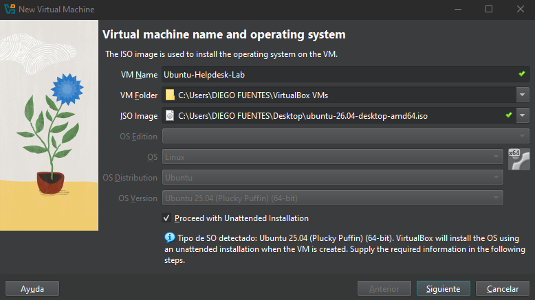
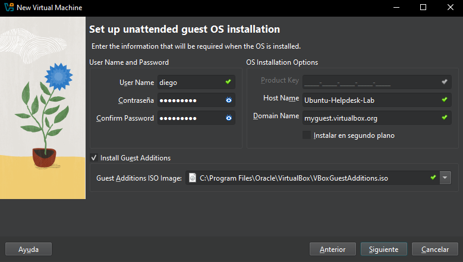
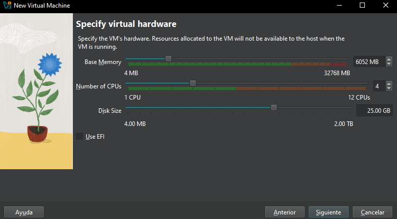

**IHS-3 — Boot failure:** Reviewed boot logs and disk/partition health. Ruled out hardware failure and identified a corrupted display driver as the root cause.

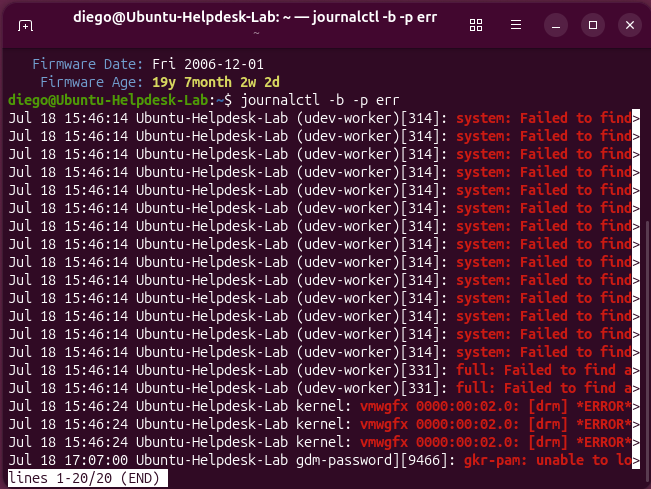
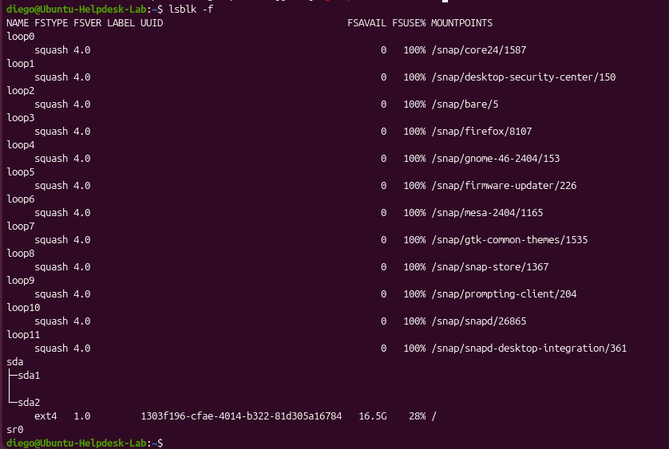
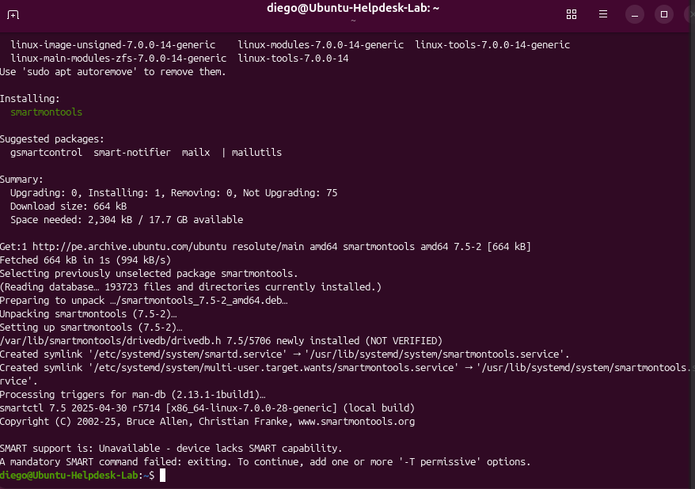
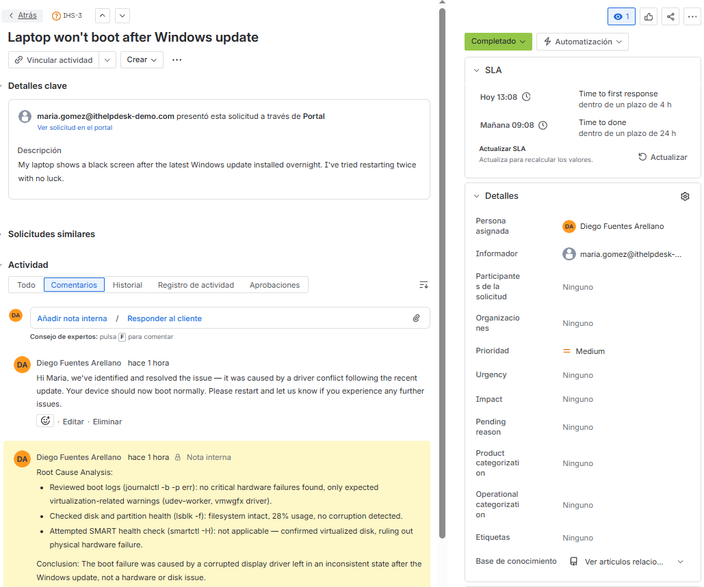

**IHS-4 — VPN connectivity:** Verified network interface and internet connectivity, then found the VPN profile was missing from the device and reconfigured it.

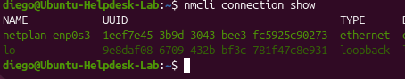
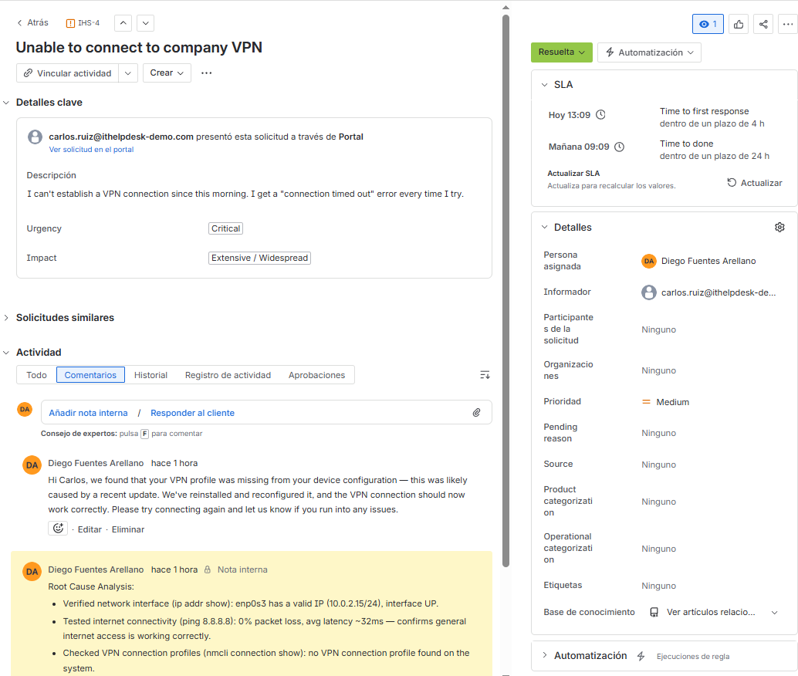

**IHS-5 — Account lockout:** Checked authentication logs and lockout status, confirmed no unauthorized access attempts, and reset the failed-attempt counter.

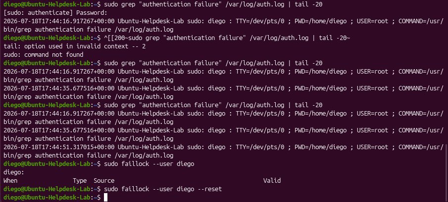
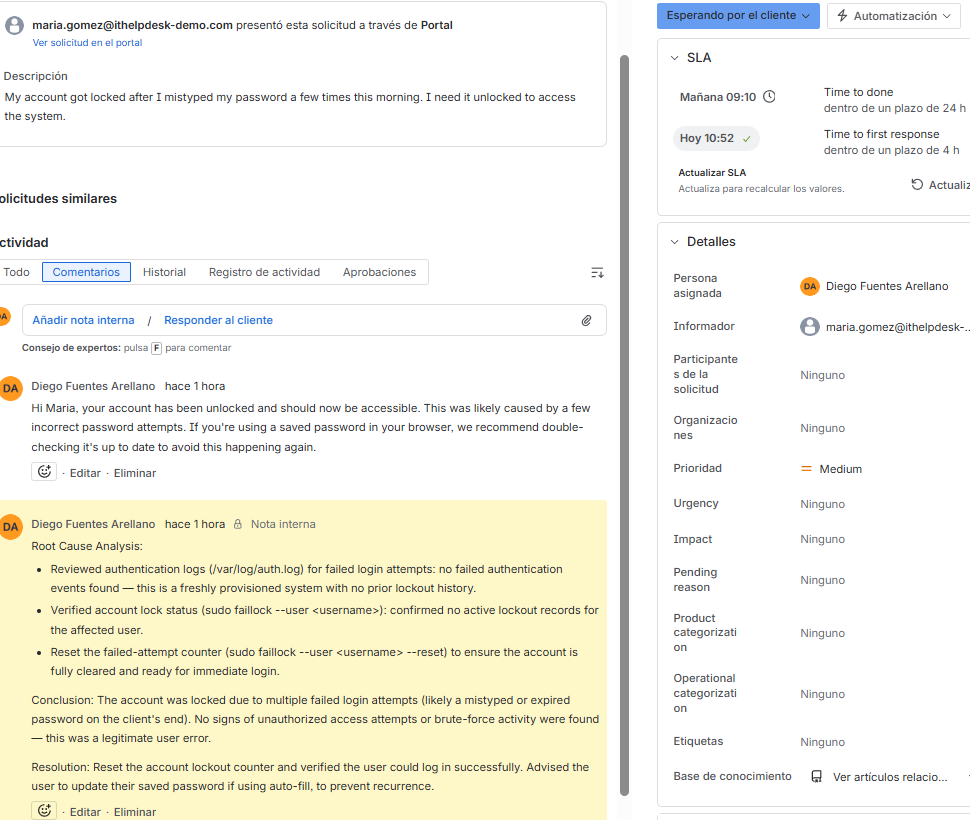

All three tickets were resolved within SLA, with internal root-cause notes and customer-facing responses documented directly in Jira.

## 📊 Week 4 — Analysis & Results
Exported the 3 resolved tickets from Jira to CSV and analyzed them with a Python script (pandas + matplotlib), run locally in VS Code.

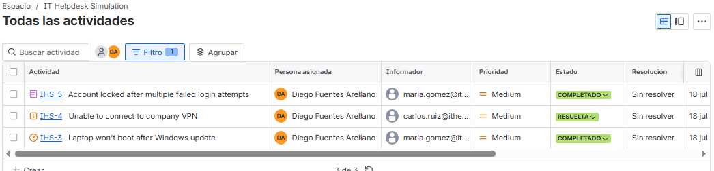

**Key metrics:**
- Total tickets analyzed: 3
- Average resolution time: 1.58 hours
- SLA compliance rate: 100% (all tickets resolved well within the 24h target)
- Incident types: Hardware Issue, Network Problem, Software/Access Issue (evenly distributed)

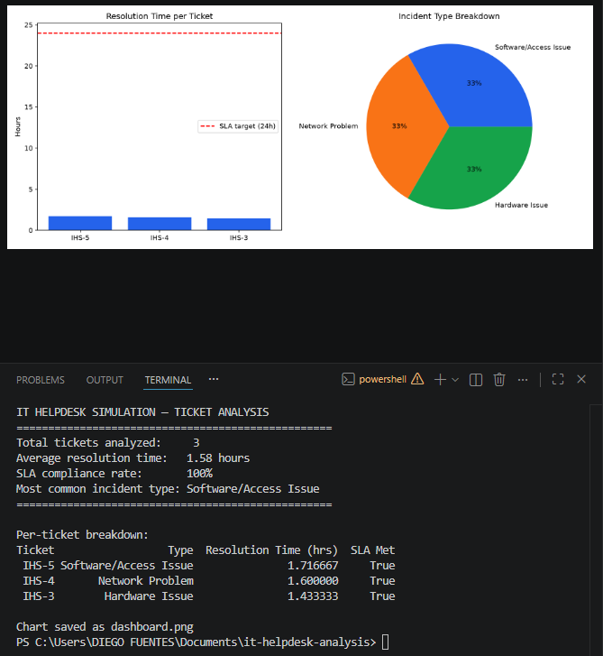

See [`analyze_tickets.py`](analyze_tickets.py) for the full analysis script.

## 🚀 Key Takeaways
This project demonstrates the full lifecycle of IT support ticket management — from configuring a service desk and defining SLAs, to hands-on Linux troubleshooting in a virtualized environment, to translating raw ticket data into actionable KPIs using Python. It combines practical IT support skills (Jira, Linux, VirtualBox) with a data-driven mindset, reflecting the kind of Level 2 support role that also contributes to service quality reporting.
